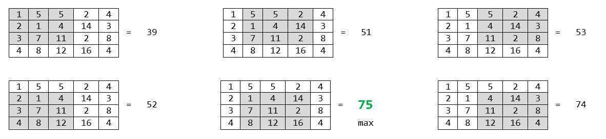
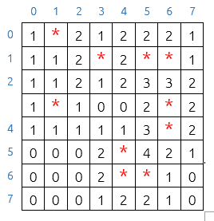

# Ejercicio Práctico
#### Primer trimestre: unidades 1, 2 y 3

Para resolver este ejercicio está permitido:
- Consultar la documentación publicada en el curso del Módulo de Programación en [Aulas Virtuales](https://aulasvirtuales.educastur.es).
- Consultar la [documentación del API de Java](https://docs.oracle.com/en/java/javase/25/docs/api/index.html).
- Consultar la [especificación del lenguaje Java](https://docs.oracle.com/javase/specs/jls/se25/html/index.html).

No está permitido:
- Consultar cualquier otra documentación.
- Consultar ejercicios resueltos.
- Consultar código fuente publicado en Internet o en cualquier otro soporte, independientemente del lenguaje de programación usado.
- Utilizar inteligencia artificial durante la realización de la práctica.

Haz un fork de este repositorio desde tu cuenta de GitHub, clónalo desde Eclipse e importa el proyecto Maven que contiene.

Dentro de `src/main/java`, en el paquete `fp.dam.java`, encontrarás una clase vacía llamada `Main`. Define en ella cuatro métodos estáticos llamados `m1`, `m2`, `m3a` y `m3b` según las especificaciones siguientes:

### Método `m1`
Acepta una cadena para extraer de ella todas las subcadenas formadas por dos o más caracteres repetidos y almacenarlas en un `ArrayList`. Retorna el `ArrayList`.

**Este método se debe implementar sin usar expresiones regulares.**

### Método `m2`
Hace lo mismo que el anterior con la ayuda de la siguiente expresión regular: `(.)\1+`

### Método `m3a`
Acepta una matriz y retorna el valor máximo de los resultados obtenidos al sumar los elementos de cada matriz interna de 3x3.

La matriz no puede tener un número de filas o un número de columnas inferior a 3. En caso contrario retorna `null`.

Ejemplo:
      

      
En este ejemplo el método retorna el valor 75.

### Método `m3b`
Crea y retorna el tablero de juego del buscaminas según las especificaciones siguientes:

- Acepta un número entero indicando el tipo de tablero:

    + Si recibe un 1, crea un tablero de 8x8 con 10 minas.
    + Si recibe un 2, crea un tablero de 16x16 con 40 minas.
    + Si recibe un 3, crea un tablero de 16x30 con 99 minas.
    + Si recibe cualquier otro valor retorna inmediatamente el valor null.
       
- El tablero estará representado por una matriz de números enteros en la que cada posición `[i][j]` representa la casilla situada en la fila i, columna j del tablero.
       
- La minas se colocan de forma aleatoria.

- Para representar una mina en la fila i, columna j del tablero, se almacena el valor `-1` en la posición `[i][j]` de la matriz.

- Cada posición `[i][j]` de la matriz que no represente una mina debe contener el número de minas que rodean a esa casilla.
    
Ejemplo de tablero de 8x8:

### IMPORTANTE
**No crees programas de prueba, limítate a implementar únicamente los métodos que se piden**. Para probar su funcionamiente entra en la carpeta `src/test/java` y dentro de ella en el paquete `fp.dam.java`. Después, ejecuta los tests unitarios de la clase `Test20251202` pulsando sobre ella con el botón derecho del ratón y seleccionando la opción ***Run As -> JUnitTest***.